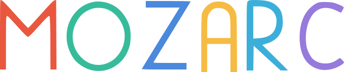

  

  

 

Our first typeface. 💃

crafted with &hearts; by your friends on the <a href="https://srmkzilla.net">SRMKZILLA</a> team.

    
    
    

> Great design isn't magic, it is crafted with care by real people. Meet Mozarc, a typeface crafted with ♡ by your friends on the SRMKZILLA team.

## Preview 📺

  
  
  

## License 📜

`mozart` is available under the SIL Open Font License (OFL).

## Contributing 🤝

Please read `Contributing.md` for details on our code of conduct, and the process for submitting pull requests to us.

## Shout outs 💥

| 
 [Eashaankar Sahai](https://www.behance.net/eashaankarsahai)
 | 
 [Rahul Kumar]()
 |
| ---------------------------------------------------------------------------------------------------------------------------------------------------- | --------------------------------------------------------- |

## Forking this repo 🚨

Many people have contacted us asking if they can use this font for their own projects. The answer to that question is usually "yes", with attribution. There are some cases, such as using this font for a business or something that is greater than a personal project, that we may be less comfortable saying yes to. If in doubt, please don't hesitate to ask us.

We value keeping this project open source, but as you all know, _**plagiarism is bad**_. We spent a non-negligible amount of effort developing, designing, and trying to perfect this iteration of our project, and we are proud of it! All we ask is to not claim this effort as your own.

So, feel free to fork this repo. If you do, please just give us proper credit by linking back to our website, https://srmkzilla.net. Refer to this handy [quora post](https://www.quora.com/Is-it-bad-to-copy-other-peoples-code) if you're not sure what to do. Thanks!
